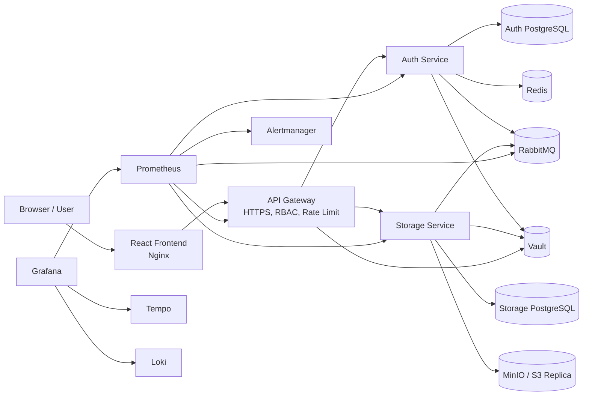

# Cloud Storage Platform

A portfolio-grade distributed cloud storage and observability platform built with Spring Boot, React, RabbitMQ, PostgreSQL, Redis, Vault, MinIO, Prometheus, Grafana, Tempo, and Loki.

This project is designed to demonstrate backend/system-design skills: API gateway security, asynchronous event processing, idempotent consumers, retry/DLQ handling, encrypted object storage, WAL-style recovery, replication, and production-style telemetry.

> This is a portfolio and system-design demonstration project. It is not a managed production SaaS. Local secrets and demo credentials are intentionally simple for repeatable local execution and must be replaced before any real deployment.
> Development TLS/mTLS certificates are generated locally and are intentionally not committed.

## What This System Does

- Serves a React cloud-drive frontend at `http://localhost:8088`.
- Routes all API traffic through an HTTPS Spring Cloud Gateway at `https://localhost:8443`.
- Provides user, moderator, and admin panels with role-based visibility.
- Supports register, login, logout, verify email, forgot password, reset password, account lock/suspend, and role updates.
- Publishes auth events to RabbitMQ and consumes them with manual ack, idempotency, retry queues, and DLQs.
- Stores user files through a storage service with encryption at rest, hash-based deduplication, WAL tracking, saga state tracking, GC, and MinIO replication.
- Exposes metrics through Prometheus, dashboards through Grafana, traces through Tempo, and structured logs through Loki.
- Includes alerting through Prometheus Alertmanager and a local webhook receiver.

## Architecture



More diagrams are available in [`docs/architecture`](docs/architecture).

## Tech Stack

- Backend: Java 21, Spring Boot, Spring Security, Spring Cloud Gateway, Spring AMQP, Spring Data JPA
- Frontend: React, Axios, Nginx static serving
- Data: PostgreSQL, Redis
- Messaging: RabbitMQ with retry queues and DLQs
- Storage: encrypted local blob storage plus MinIO/S3-style replication
- Secrets: HashiCorp Vault dev mode for local secret injection
- Observability: Prometheus, Grafana, Tempo, Loki, Promtail, Alertmanager
- Delivery: Docker Compose, GitHub Actions CI, Kubernetes-ready baseline manifests

## Module Breakdown

### Module 1: API Gateway and Security

- Central HTTPS entrypoint.
- JWT validation and route-level RBAC.
- Redis-backed rate limiting.
- Circuit breaker, timeout, fallback, and gateway retry behavior.
- Internal management ports for metrics scraping.

### Module 2: Distributed Async Processing

- RabbitMQ event topology for critical auth events.
- At-least-once delivery model.
- Durable main queues, retry queues, and DLQs.
- Manual ack/nack consumer pattern.
- Consumer-side idempotency through processed message tracking.

### Module 3: Object Storage Engine

- Upload, download, metadata, delete, folder, move, copy, and conflict semantics.
- AES-based encryption at rest.
- Hash-based deduplication/reference model.
- WAL-style operation tracking and startup recovery.
- Saga state tracking and basic compensation visibility.
- Background garbage collection.
- MinIO/S3 replication with retry and DLQ handling.

### Module 4: Observability

- Prometheus metrics for system and business events.
- Grafana dashboard: `Cloud Storage Platform Overview`.
- Tempo tracing and Loki centralized structured log search.
- Correlation ID, trace ID, span ID, method, path, status, and duration in JSON logs.
- Alertmanager rules for service down, latency, error rate, DLQ, replication failures, JVM memory, broker, DB, and Redis health.

### Module 5: Proof Package

- Architecture docs and Mermaid diagrams.
- Runtime verification scripts.
- Evidence checklist and screenshot folders.
- k6 load-test scripts.
- GitHub Actions CI.
- Kubernetes-ready baseline manifests.
- Demo script, CV summary, and interview talking points.

## Local Run

Prerequisites:

- Docker and Docker Compose
- Java 21 and Maven, only if running services outside Docker
- Node.js, only if running frontend outside Docker
- OpenSSL, only when regenerating local development certificates

Generate local development certificates if they are missing:

```bash
./scripts/generate-dev-certs.sh
```

Prepare local environment values:

```bash
cp auth-system/.env.example auth-system/.env
```

Start the full stack:

```bash
cd auth-system
docker compose up -d --build
```

Main URLs:

- Frontend: `http://localhost:8088`
- API Gateway: `https://localhost:8443`
- Grafana: `http://localhost:3000` (`admin/admin`)
- Prometheus: `http://localhost:9090`
- Alertmanager: `http://localhost:9093`
- RabbitMQ: `http://localhost:15672` (`guest/guest`)
- MinIO Console: `http://localhost:9001` (`minioadmin/minioadmin`)

Run verification:

```bash
./scripts/verify-stack.sh
```

The verification script installs frontend dependencies when needed, then compiles/builds all services and checks the running Docker Compose stack.

## What To Demo

1. Open `http://localhost:8088` and register or log in.
2. Use the user panel as a cloud drive: upload files, create folders, move/copy/delete, and test conflict handling.
3. Log in as an admin and show users, storage objects, async engine summary, replication tasks, WAL, saga state, and Grafana link.
4. Open Grafana and show service health, request metrics, RabbitMQ queue depth, storage metrics, logs, and trace links.
5. Open Prometheus targets and show all targets `UP`.
6. Open RabbitMQ and show main/retry/DLQ topology.
7. Explain idempotency, retry queues, DLQ handling, WAL recovery, and observability correlation.

## Evidence

Follow [`docs/evidence/CHECKLIST.md`](docs/evidence/CHECKLIST.md) before recording a demo or sharing the repository. Screenshots should be placed under `docs/evidence/screenshots`.

Current proof package:

- Architecture diagrams: [`docs/architecture`](docs/architecture)
- Runtime verification guide: [`docs/evidence/runtime-verification.md`](docs/evidence/runtime-verification.md)
- Runtime output placeholder: [`docs/evidence/runtime-output.txt`](docs/evidence/runtime-output.txt)
- Load-test result placeholder: [`docs/evidence/load-test-results.md`](docs/evidence/load-test-results.md)
- Demo walkthrough: [`docs/demo-script.md`](docs/demo-script.md)
- Interview notes: [`docs/interview-talking-points.md`](docs/interview-talking-points.md)

## Load Tests

Install k6 and run:

```bash
k6 run load-tests/k6/gateway-auth-smoke.js
k6 run load-tests/k6/storage-smoke.js
```

Paste relevant output into `docs/evidence/load-test-results.md`.

## CI

The GitHub Actions workflow compiles all backend services, builds the frontend, and validates Docker Compose syntax without requiring external secrets.

## Kubernetes

`deploy/k8s` contains baseline Kubernetes manifests intended to show deployment readiness. Docker Compose remains the primary local demo runtime.

## Security Notes

- Local default secrets are for development only.
- Vault runs in dev mode for reproducible local demos.
- Development TLS/mTLS certificates are generated by `scripts/generate-dev-certs.sh` and must be rotated/replaced for any non-local environment.
- Do not publish real email app passwords, production JWT secrets, or production private certificates.
- Replace demo credentials before deploying outside your machine.
